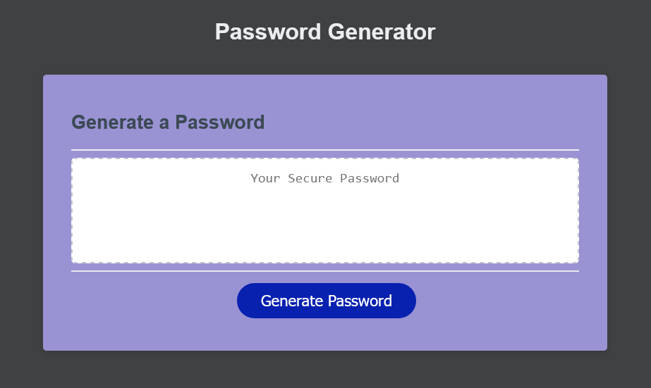

# Password Generator

## Description

This application generates a random passoword based on the user's chosen criterias; length of the password and the types of characters included in the password.

## Table of Contents

- [Installation](#installation)
- [Usage](#usage)
- [Deployed application](#deployed-application)
- [Screen Shot](#screenshot)
- [Credits](#credits)
- [License](#license)

## Installation

In order to install this project, you must login to GitHub. Once there you will click on the green button that says clone or download. You will be given choices on how to download: using the ssh/html key or downloading the zip file.

Using SSH/HTML Key: You will copy the link shown and open up either terminal (mac: pre-installed) or gitbash (pc: must be installed). Once the application is open, you will type git clone paste url here. Once you have cloned the htx-tacos repo, cd into the repo and type "open ." to open the folder which contains all files used for the website. You can also type "code ." to open the repo in VS code.

Using Download ZIP: Click on Download Zip. Locate the file and double click it to unzip the file. Locate the unzipped folder and and open it. All the files for the website will be within this folder.

## Usage

Simply click on the live link listed below. Or open the index.html file on your browser.

When the "generate password" button is clicked, the application presents a series of prompts for inputs and validations:

- Length of password (between 10 and 64)

- Types of characters to be included in the password (Lowercase, Uppercase, Numeric, Special characters). At least one.

Once all prompts are answered, the password is generated.

## Deployed application
https://kamel-beloula.github.io/Console-Finances/

## Screenshot

## Credits

Trilogy Education Services Frontend Web Development bootcamp website.  

## License

MIT License

Copyright (c) 2022 kamel beloula

Permission is hereby granted, free of charge, to any person obtaining a copy of this software and associated documentation files (the "Software"), to deal in the Software without restriction, including without limitation the rights to use, copy, modify, merge, publish, distribute, sublicense, and/or sell copies of the Software, and to permit persons to whom the Software is furnished to do so, subject to the following conditions:

The above copyright notice and this permission notice shall be included in all copies or substantial portions of the Software.

THE SOFTWARE IS PROVIDED "AS IS", WITHOUT WARRANTY OF ANY KIND, EXPRESS OR IMPLIED, INCLUDING BUT NOT LIMITED TO THE WARRANTIES OF MERCHANTABILITY, FITNESS FOR A PARTICULAR PURPOSE AND NONINFRINGEMENT. IN NO EVENT SHALL THE AUTHORS OR COPYRIGHT HOLDERS BE LIABLE FOR ANY CLAIM, DAMAGES OR OTHER LIABILITY, WHETHER IN AN ACTION OF CONTRACT, TORT OR OTHERWISE, ARISING FROM, OUT OF OR IN CONNECTION WITH THE SOFTWARE OR THE USE OR OTHER DEALINGS IN THE SOFTWARE.